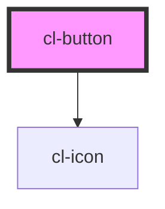

# cl-button

<!-- Auto Generated Below -->

## Properties

| Property     | Attribute    | Description                                                                            | Type                                               | Default     |
| ------------ | ------------ | -------------------------------------------------------------------------------------- | -------------------------------------------------- | ----------- |
| `disabled`   | `disabled`   | Determines whether the disabled styling and behaviour is applied or not.               | `boolean`                                          | `false`     |
| `error`      | `error`      | Determines whether the error styling is applied or not.                                | `boolean`                                          | `false`     |
| `iconName`   | `icon-name`  | Name of the icon used in the button. If not set no icon wil be displayed.              | `string`                                           | `''`        |
| `name`       | `name`       | The 'name' attribute of the 'input' element                                            | `string`                                           | `''`        |
| `processing` | `processing` | Determines whether the processing styling is applied or not.                           | `boolean`                                          | `false`     |
| `selected`   | `selected`   | Specifies whether the selected styling should be applied.                              | `boolean`                                          | `false`     |
| `small`      | `small`      | Determines whether the small styling is applied or not.                                | `boolean`                                          | `false`     |
| `type`       | `type`       | Specifies the value of the type attribute the underlying button component should have. | `"button" \| "reset" \| "submit"`                  | `'button'`  |
| `variant`    | `variant`    | Specifies the styling of the button.                                                   | `"primary" \| "secondary" \| "tertiary" \| "text"` | `'primary'` |

## CSS Custom Properties

| Name                        | Description                                            |
| --------------------------- | ------------------------------------------------------ |
| `--button-background-color` | Button background color override Default: undefined    |
| `--button-border-color`     | Button border color override Default: undefined        |
| `--button-color`            | Button text and icon color override Default: undefined |

## Dependencies

### Depends on

- [cl-icon](../cl-icon)

### Graph

----------------------------------------------

Built with love
