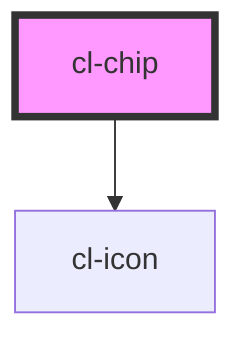

# Chip

## Usage

### Default

```preview
<cl-chip>Regular</cl-chip>
<cl-chip small>Small</cl-chip>
  ```

```html
<cl-chip>Regular</cl-chip>
<cl-chip small>Small</cl-chip>
```

### Regular size

```preview
<cl-chip>Enabled</cl-chip>
<cl-chip icon-name="action--close">Tag</cl-chip>
<cl-chip counter="100" icon-name="action--close">Enabled</cl-chip>
<cl-chip counter="50" icon-name="action--close" selected>Selected</cl-chip>
<cl-chip icon-name="action--close" icon-left disabled>Disabled</cl-chip>
  ```


```html
<cl-chip>Enabled</cl-chip>
<cl-chip icon-name="action--close">Tag</cl-chip>
<cl-chip counter="100" icon-name="action--close">Enabled</cl-chip>
<cl-chip counter="50" icon-name="action--close" selected>Selected</cl-chip>
<cl-chip icon-name="action--close" icon-left disabled>Disabled</cl-chip>
```

### Small size

```preview
<cl-chip small>Enabled</cl-chip>
<cl-chip small icon-name="action--close">Tag</cl-chip>
<cl-chip small counter="100" icon-name="action--close">Enabled</cl-chip>
<cl-chip small counter="50" icon-name="action--close" selected>Selected</cl-chip>
<cl-chip small icon-name="action--close" icon-left disabled>Disabled</cl-chip>
  ```


```html
<cl-chip small>Enabled</cl-chip>
<cl-chip small icon-name="action--close">Tag</cl-chip>
<cl-chip small counter="100" icon-name="action--close">Enabled</cl-chip>
<cl-chip small counter="50" icon-name="action--close" selected>Selected</cl-chip>
<cl-chip small icon-name="action--close" icon-left disabled>Disabled</cl-chip>
```

### Read Only

```preview
<cl-chip read-only>Regular</cl-chip>
<cl-chip small read-only>Small</cl-chip>
  ```

```html
<cl-chip read-only>Regular</cl-chip>
<cl-chip small read-only>Small</cl-chip>
```


<!-- Auto Generated Below -->


## Properties

| Property   | Attribute   | Description                                                                        | Type      | Default |
| ---------- | ----------- | ---------------------------------------------------------------------------------- | --------- | ------- |
| `counter`  | `counter`   | Number that the chip displays. If the value is `null`, then no number is displayed | `number`  | `null`  |
| `disabled` | `disabled`  | Determines whether the disabled styling is applied or not                          | `boolean` | `false` |
| `iconLeft` | `icon-left` | Determines whether the icon is displayed on the left or on the right               | `boolean` | `false` |
| `iconName` | `icon-name` | Name of the icon used in the button                                                | `string`  | `''`    |
| `readOnly` | `read-only` | Determines whether the chip is read-only or not                                    | `boolean` | `false` |
| `selected` | `selected`  | Determines whether the chip has selected styling or not                            | `boolean` | `false` |
| `small`    | `small`     | Determines whether the chip has a small of regular size                            | `boolean` | `false` |


## Events

| Event         | Description                                                                                                                                                                                                      | Type                                              |
| ------------- | ---------------------------------------------------------------------------------------------------------------------------------------------------------------------------------------------------------------- | ------------------------------------------------- |
| `clicked`     | Gets emitted on a click on the chip. An object that contains the properties 'id' and 'selected' is emitted. The latter indicates the new 'selected' value after the click event on the chip element.             | `CustomEvent<{ id: string; selected: boolean; }>` |
| `iconClicked` | Gets emitted on a click on the icon in the chip. An object that contains the properties 'id' and 'selected' is emitted. The latter indicates the new 'selected' value after the click event on the chip element. | `CustomEvent<{ id: string; selected: boolean; }>` |


## Dependencies

### Depends on

- [cl-icon](../cl-icon)

### Graph


----------------------------------------------

Built with love
