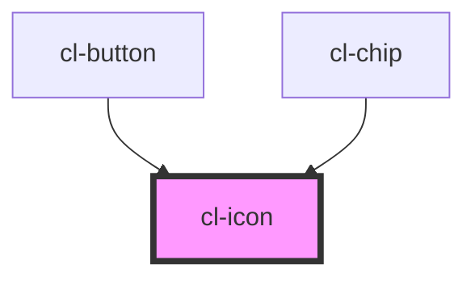

# Icon

## Usage

### Name

```preview
  <cl-icon name="communication--device--pc"></cl-icon>
  <cl-icon name="action--like"></cl-icon>
  <cl-icon name="action--share"></cl-icon>
```

```html
  <cl-icon name="communication--device--pc"></cl-icon>
  <cl-icon name="action--like"></cl-icon>
  <cl-icon name="action--share"></cl-icon>
```

### Fill Color

```preview
  <cl-icon name="communication--device--pc" fill-color="var(--color-primary-main)"></cl-icon>
  <cl-icon name="action--like" fill-color="var(--color-secondary-main)"></cl-icon>
  <cl-icon name="action--share" fill-color="var(--color-tertiary-main)"></cl-icon>
```

```html
<cl-icon name="communication--device--pc" fill-color="var(--color-primary-main)"></cl-icon>
  <cl-icon name="action--like" fill-color="var(--color-secondary-main)"></cl-icon>
  <cl-icon name="action--share" fill-color="var(--color-tertiary-main)"></cl-icon>
```

### Size

You only have to use a number and it will automatically use the rem unit for size

```preview
<cl-icon name="communication--device--pc" fill-color="var(--color-primary-main)" size="0"></cl-icon>
<cl-icon name="communication--device--pc" fill-color="var(--color-primary-main)" size="1"></cl-icon>
<cl-icon name="communication--device--pc" fill-color="var(--color-primary-main)" size="2"></cl-icon>
<cl-icon name="communication--device--pc" fill-color="var(--color-primary-main)" size="4"></cl-icon>
<cl-icon name="communication--device--pc" fill-color="var(--color-primary-main)" size="8"></cl-icon>
<cl-icon name="communication--device--pc" fill-color="var(--color-primary-main)" size="16"></cl-icon>
```

```html
<cl-icon name="communication--device--pc" fill-color="var(--color-primary-main)" size="0"></cl-icon>
<cl-icon name="communication--device--pc" fill-color="var(--color-primary-main)" size="1"></cl-icon>
<cl-icon name="communication--device--pc" fill-color="var(--color-primary-main)" size="2"></cl-icon>
<cl-icon name="communication--device--pc" fill-color="var(--color-primary-main)" size="4"></cl-icon>
<cl-icon name="communication--device--pc" fill-color="var(--color-primary-main)" size="8"></cl-icon>
<cl-icon name="communication--device--pc" fill-color="var(--color-primary-main)" size="16"></cl-icon>
```


<!-- Auto Generated Below -->


## Properties

| Property    | Attribute    | Description                                              | Type     | Default |
| ----------- | ------------ | -------------------------------------------------------- | -------- | ------- |
| `ariaLabel` | `aria-label` | Screenreader label                                       | `string` | `''`    |
| `fillColor` | `fill-color` | FillColor of the icon                                    | `string` | `''`    |
| `name`      | `name`       | Name of the icon, is used to lookup icon in sprite sheet | `string` | `''`    |
| `size`      | `size`       | Determines the size of the icon component in REM         | `number` | `null`  |


## CSS Custom Properties

| Name           | Description                                                 |
| -------------- | ----------------------------------------------------------- |
| `--icon-color` | color of the icon Default: currentColor                     |
| `--icon-size`  | width and height of the icon Default: var(--size-spacing-3) |


## Dependencies

### Used by

 - [cl-button](../cl-button)
 - [cl-chip](../cl-chip)

### Graph


----------------------------------------------

Built with love
